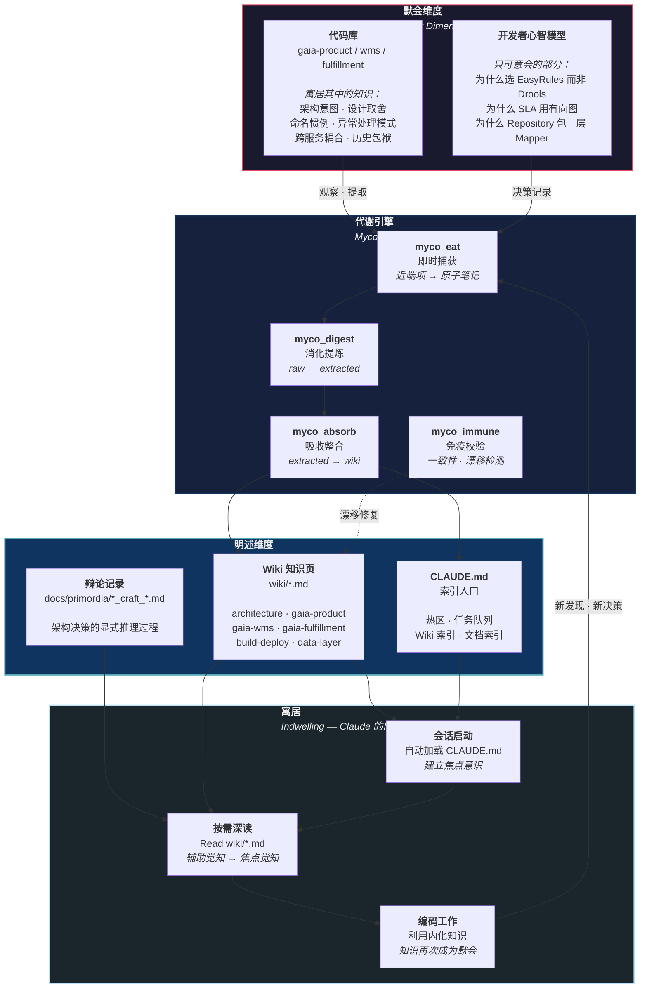
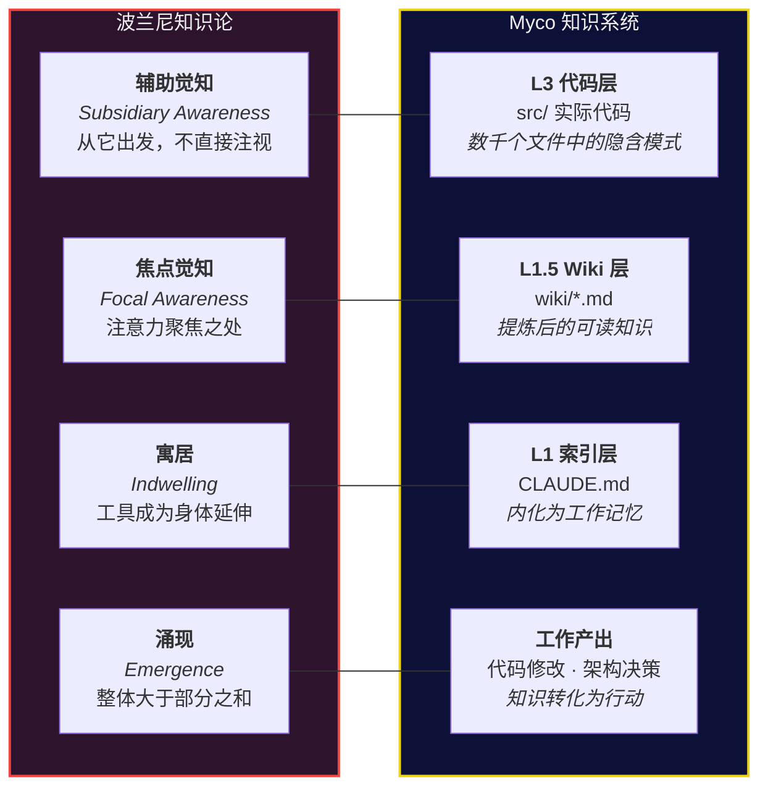
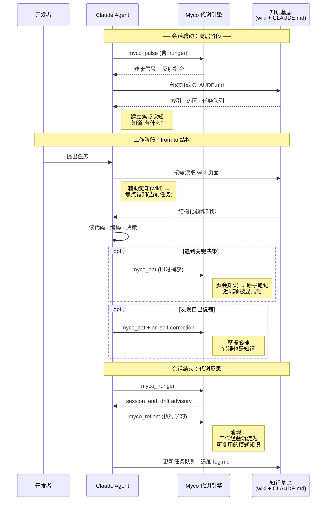
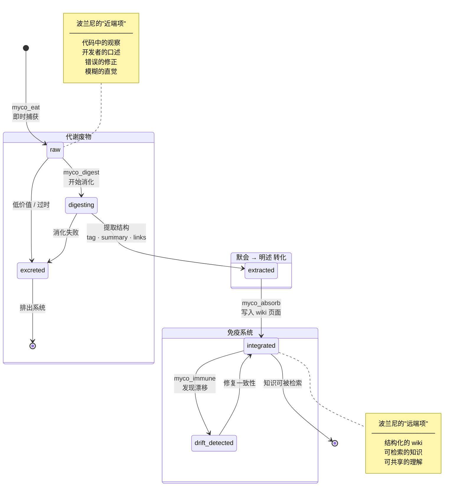
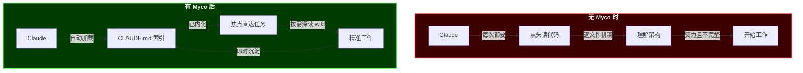
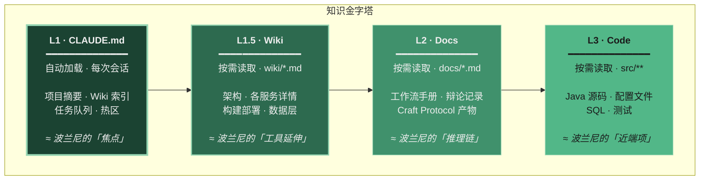

# Myco 知识代谢机制：默会维度

> *"We can know more than we can tell."*
> — Michael Polanyi, *The Tacit Dimension* (1966)

---

## 核心隐喻：从默会到明述

波兰尼将知识分为两个维度——**默会知识**（tacit knowing）与**明述知识**（explicit knowing）。我们骑自行车时知道如何保持平衡，却无法用公式讲清楚；外科医生的手感、棋手的直觉、程序员读代码时"闻到"的 bad smell——这些都是默会知识。

波兰尼的关键洞见是 **from-to 结构**：

- **近端项**（proximal term）：我们**从**它出发，辅助性地觉知它，却无法直接注视它
- **远端项**（distal term）：我们**朝向**它聚焦，它是注意力的焦点

> 当你用锤子钉钉子时，你**从**手掌的触感**朝向**钉头聚焦。
> 你并不注意手掌——但如果戴上手套，你就"失去了手感"。

Myco 做的事情，正是将散落在代码库中的**默会知识**（近端项），经由消化代谢，转化为可以被 Claude 聚焦阅读的**明述知识**（远端项）。

---

## 知识流转全景

---

## 波兰尼四层映射

---

## 单次会话的知识生命周期

---

## 代谢流水线：原子笔记的一生

---

## Claude 如何"寓居"于知识

波兰尼的 **indwelling**（寓居）概念是理解 Claude 与 Myco 关系的关键。

盲人用拐杖探路时，拐杖的触感不再是"手掌上的压力"，而变成了"前方地面的形状"——拐杖成为身体的延伸。同样地：

| 无 Myco | 有 Myco |
|---------|---------|
| 每次会话从零开始 | 知识在会话间持续积累 |
| 代码即文档（但代码不会自我解释） | 结构化 wiki 提供"为什么" |
| 默会知识困在开发者脑中 | 默会知识被外化、可传递 |
| Claude 是无记忆的工具 | Claude **寓居**于知识基底之中 |

---

## 知识加载层级

越往上，知识越**显式、浓缩、可直接使用**；
越往下，知识越**隐含、丰富、需要解读**。

Myco 的代谢方向始终是 **L3 → L1**：从代码的默会知识中提炼出可传递的明述知识。

---

## 附：波兰尼核心概念速查

| 概念 | 原文 | Myco 对应 |
|------|------|-----------|
| 默会知识 | Tacit Knowing | 代码库中的架构意图、设计取舍、命名惯例 |
| 明述知识 | Explicit Knowing | Wiki 页面、CLAUDE.md、辩论记录 |
| 辅助觉知 | Subsidiary Awareness | 背景性的代码理解（不直接注视但依赖） |
| 焦点觉知 | Focal Awareness | 当前任务聚焦的具体问题 |
| from-to 结构 | From-To Structure | 从代码(近端) → 到 wiki(远端) → 到工作产出 |
| 寓居 | Indwelling | Claude 将 CLAUDE.md 内化为工作记忆 |
| 涌现 | Emergence | 结构化知识使 Agent 能力超越单次代码阅读 |
| 个人知识 | Personal Knowledge | 开发者独有的上下文，通过 myco_eat 外化 |

---

> *工具最好的状态，是你忘了它的存在。*
> *Myco 最好的状态，是 Claude 不再需要"从头读代码"。*
> *这就是波兰尼所说的寓居——知识成为了身体的延伸。*
