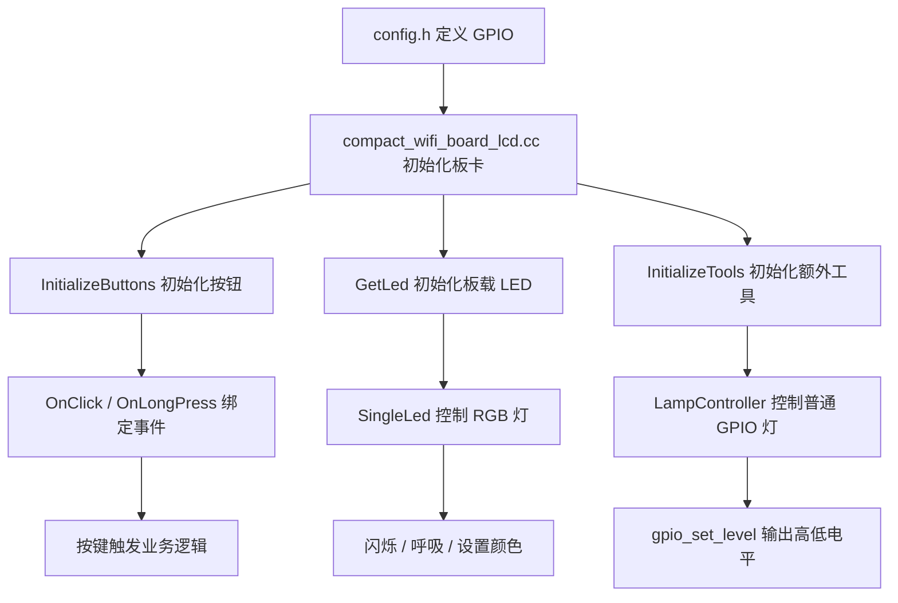
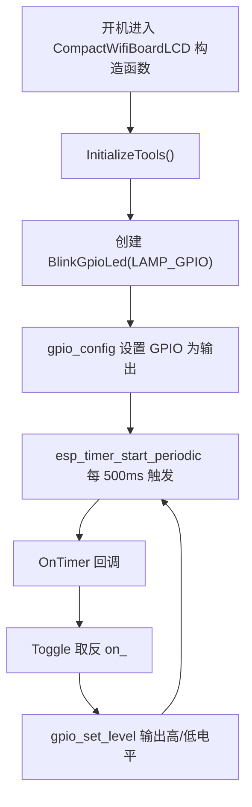
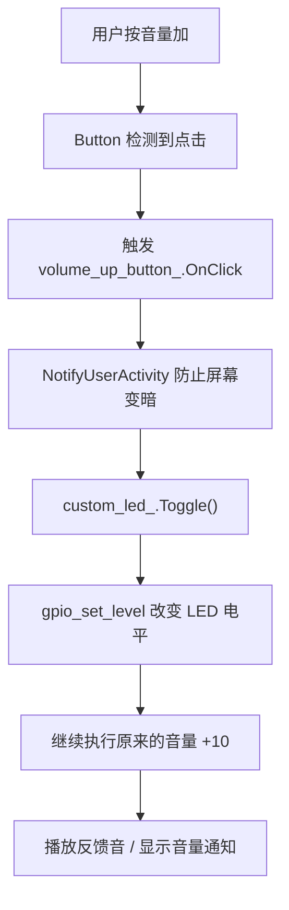
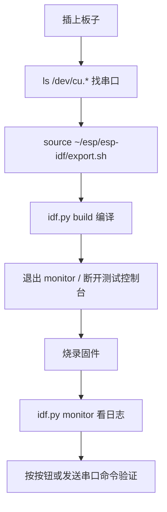

# 小智固件源码入门：引脚定义、LED 定时闪烁、按键控制

这份文档按“小智 AI 学习导师 Agent”的方式写给固件新手。目标不是让你马上看懂所有 C++，而是通过一个具体例子认识源码结构：

- 怎么找当前板子的引脚定义
- 如果新接一个普通 LED，怎么让它定时闪烁
- 如果不用定时闪烁，而是按音量加按钮控制 LED，应该改哪里
- 学习时哪些代码先看，哪些可以先跳过

## 当前问题属于哪一层

```text
固件层 + 硬件引脚层 + 按键事件层
```

你现在问的是：**ESP32 固件源码如何把“物理引脚”变成“软件功能”。**

可以先用一句话理解：

```text
config.h 告诉固件硬件接在哪个 GPIO；
board_xxx.cc 把 GPIO 初始化成按钮、屏幕、音频、LED；
Application 负责更高层状态；
具体外设类负责具体动作。
```

## 先看哪几个文件

你当前这块板子的命中目录是：

```text
/Users/liran/workspace/others/xiaozhi-esp32/main/boards/bread-compact-wifi-lcd
```

优先看这几个文件：

| 文件 | 先看什么 | 作用 |
|---|---|---|
| `main/boards/bread-compact-wifi-lcd/config.h` | `GPIO_NUM_xx` | 当前板子的引脚表 |
| `main/boards/bread-compact-wifi-lcd/compact_wifi_board_lcd.cc` | `InitializeButtons()`、`GetLed()` | 把引脚变成功能 |
| `main/led/single_led.cc` | `StartContinuousBlink()`、`SetRgb()` | 内置 WS2812 RGB LED 的控制逻辑 |
| `main/boards/common/lamp_controller.h` | `gpio_config()`、`gpio_set_level()` | 普通 GPIO 灯的最小控制例子 |
| `main/application.cc` | 暂时只看 `Board::GetInstance()` 相关调用 | 设备主状态机 |

## 当前板子的关键引脚

来自：

```text
main/boards/bread-compact-wifi-lcd/config.h
```

当前已经定义了：

```cpp
#define BUILTIN_LED_GPIO        GPIO_NUM_48
#define BOOT_BUTTON_GPIO        GPIO_NUM_0
#define VOLUME_UP_BUTTON_GPIO   GPIO_NUM_38
#define VOLUME_DOWN_BUTTON_GPIO GPIO_NUM_39
#define DISPLAY_BACKLIGHT_PIN   GPIO_NUM_42
#define LAMP_GPIO               GPIO_NUM_18
```

先用白话理解：

| 名称 | GPIO | 含义 |
|---|---:|---|
| `BUILTIN_LED_GPIO` | 48 | 板载 RGB LED，通常是 WS2812 这种单线彩灯 |
| `BOOT_BUTTON_GPIO` | 0 | 启动/配置按钮 |
| `VOLUME_UP_BUTTON_GPIO` | 38 | 音量加按钮 |
| `VOLUME_DOWN_BUTTON_GPIO` | 39 | 音量减按钮 |
| `DISPLAY_BACKLIGHT_PIN` | 42 | 屏幕背光 |
| `LAMP_GPIO` | 18 | 示例灯 GPIO，当前项目里已经有 MCP 灯控示例 |

注意：`GPIO_NUM_NC` 的意思是 **Not Connected，没有接线**。如果某个外设定义成 `GPIO_NUM_NC`，固件一般会跳过它。

## 总体流程图



## 你现在暂时不用懂的

这些可以先跳过：

- SPI 屏幕初始化细节
- I2S 音频采集和播放细节
- FreeRTOS 调度细节
- ESP-IDF CMake 组件机制
- MCP 工具注册的完整协议
- WS2812/RMT 底层时序

现在只抓主线：

```text
引脚定义 -> 初始化 GPIO -> 绑定事件或定时器 -> 控制电平
```

## 示例 1：如果新接一个普通 LED，先怎么接

假设你买了一个普通 LED，不是 RGB 灯，也不是 WS2812，只是最常见的二极管灯。

推荐接法：

```text
ESP32 GPIO -> 电阻 220Ω/330Ω -> LED 长脚
LED 短脚 -> GND
```

不要直接 GPIO 接 LED 不加电阻。电阻是为了限流，保护 ESP32 和 LED。

选 GPIO 时要注意：

- 不要选已经被屏幕、音频、按键占用的 GPIO
- 不要优先选启动相关引脚
- 你当前代码里已经有示例 `LAMP_GPIO GPIO_NUM_18`，学习时可以先用它

## 示例 2：让新 LED 定时闪烁

### 思路

普通 LED 不需要 `led_strip`。普通 LED 只要输出高低电平：

```cpp
gpio_set_level(gpio, 1); // 亮
gpio_set_level(gpio, 0); // 灭
```

定时闪烁需要一个定时器。项目里的 `SingleLed` 已经用了 `esp_timer`，所以我们可以模仿它。

### 推荐新增一个简单类

可以新建类似：

```text
main/boards/common/blink_gpio_led.h
```

示例代码：

```cpp
#ifndef __BLINK_GPIO_LED_H__
#define __BLINK_GPIO_LED_H__

#include <driver/gpio.h>
#include <esp_timer.h>
#include <esp_log.h>

class BlinkGpioLed {
private:
    gpio_num_t gpio_;
    bool on_ = false;
    esp_timer_handle_t timer_ = nullptr;

    static void OnTimer(void* arg) {
        auto self = static_cast<BlinkGpioLed*>(arg);
        self->Toggle();
    }

    void Toggle() {
        on_ = !on_;
        gpio_set_level(gpio_, on_ ? 1 : 0);
    }

public:
    explicit BlinkGpioLed(gpio_num_t gpio) : gpio_(gpio) {
        if (gpio_ == GPIO_NUM_NC) {
            return;
        }

        gpio_config_t config = {
            .pin_bit_mask = (1ULL << gpio_),
            .mode = GPIO_MODE_OUTPUT,
            .pull_up_en = GPIO_PULLUP_DISABLE,
            .pull_down_en = GPIO_PULLDOWN_DISABLE,
            .intr_type = GPIO_INTR_DISABLE,
        };
        ESP_ERROR_CHECK(gpio_config(&config));
        gpio_set_level(gpio_, 0);

        esp_timer_create_args_t timer_args = {
            .callback = &BlinkGpioLed::OnTimer,
            .arg = this,
            .dispatch_method = ESP_TIMER_TASK,
            .name = "blink_gpio_led",
            .skip_unhandled_events = false,
        };
        ESP_ERROR_CHECK(esp_timer_create(&timer_args, &timer_));
    }

    void Start(int interval_ms) {
        if (timer_ == nullptr) {
            return;
        }
        esp_timer_stop(timer_);
        esp_timer_start_periodic(timer_, interval_ms * 1000);
    }

    void Stop() {
        if (timer_ == nullptr) {
            return;
        }
        esp_timer_stop(timer_);
        on_ = false;
        gpio_set_level(gpio_, 0);
    }
};

#endif
```

### 在板卡里使用

在：

```text
main/boards/bread-compact-wifi-lcd/compact_wifi_board_lcd.cc
```

加 include：

```cpp
#include "blink_gpio_led.h"
```

在 `InitializeTools()` 里初始化：

```cpp
void InitializeTools() {
    static LampController lamp(LAMP_GPIO);

    static BlinkGpioLed custom_led(LAMP_GPIO);
    custom_led.Start(500);
}
```

这样开机后，`GPIO18` 上的 LED 会每 500ms 翻转一次，也就是闪烁。

### 定时闪烁流程图



## 示例 3：不用定时器，改成音量加按钮控制 LED

### 思路

音量加按钮已经在：

```text
main/boards/bread-compact-wifi-lcd/compact_wifi_board_lcd.cc
```

里面的：

```cpp
volume_up_button_.OnClick([this]() {
    ...
});
```

所以如果想按音量加控制 LED，最小思路是：

```text
在音量加按钮 OnClick 里，加一行 LED toggle 逻辑
```

### 推荐做一个可开关的普通 LED 类

如果只是按一下亮，再按一下灭，可以写得比定时器更简单。

示例：

```cpp
class ToggleGpioLed {
private:
    gpio_num_t gpio_;
    bool on_ = false;

public:
    explicit ToggleGpioLed(gpio_num_t gpio) : gpio_(gpio) {
        if (gpio_ == GPIO_NUM_NC) {
            return;
        }

        gpio_config_t config = {
            .pin_bit_mask = (1ULL << gpio_),
            .mode = GPIO_MODE_OUTPUT,
            .pull_up_en = GPIO_PULLUP_DISABLE,
            .pull_down_en = GPIO_PULLDOWN_DISABLE,
            .intr_type = GPIO_INTR_DISABLE,
        };
        ESP_ERROR_CHECK(gpio_config(&config));
        gpio_set_level(gpio_, 0);
    }

    void Toggle() {
        if (gpio_ == GPIO_NUM_NC) {
            return;
        }
        on_ = !on_;
        gpio_set_level(gpio_, on_ ? 1 : 0);
    }

    bool IsOn() const {
        return on_;
    }
};
```

### 放到板卡类里

更干净的方式是把 LED 对象作为板卡类成员：

```cpp
class CompactWifiBoardLCD : public WifiBoard {
private:
    Button boot_button_;
    Button volume_up_button_;
    Button volume_down_button_;
    ToggleGpioLed custom_led_{LAMP_GPIO};
    LcdDisplay* display_;
};
```

然后在音量加点击事件里加：

```cpp
volume_up_button_.OnClick([this]() {
    auto& app = Application::GetInstance();
    app.NotifyUserActivity();

    custom_led_.Toggle();
    GetDisplay()->ShowNotification(custom_led_.IsOn() ? "LED ON" : "LED OFF");

    auto codec = GetAudioCodec();
    auto old_volume = codec->output_volume();
    auto volume = codec->output_volume() + 10;
    if (volume > 100) {
        volume = 100;
    }
    ESP_LOGI(TAG, "Volume up button clicked: %d -> %d", old_volume, volume);
    codec->SetOutputVolume(volume);
    app.PlaySound(Lang::Sounds::OGG_POPUP);
    GetDisplay()->ShowNotification(Lang::Strings::VOLUME + std::to_string(volume));
});
```

不过注意：这个写法会连续显示两次通知，后面的音量通知可能把 `LED ON/OFF` 覆盖掉。

如果你更希望“音量加按钮只控制 LED，不再调音量”，那就把原本音量调节逻辑删掉或挪到长按里。但学习阶段不建议一上来改变原功能，最好先保留音量功能，只加日志或短暂通知。

### 音量键控制流程图



## 两种做法怎么选

| 需求 | 推荐方式 | 适合学习什么 |
|---|---|---|
| 开机后自动闪烁 | `esp_timer` 定时器 | 定时任务、回调函数、GPIO 输出 |
| 按按钮切换亮灭 | `Button.OnClick` | 按键事件、板卡类、状态变量 |
| RGB 变色 | 复用 `SingleLed` | WS2812、颜色、RMT |
| 让 AI 控制灯 | 复用 `LampController` / MCP | 设备工具、后端调用、IoT 控制 |

## 推荐阅读顺序

### 第一步：读引脚定义

看：

```text
main/boards/bread-compact-wifi-lcd/config.h
```

只关注：

```cpp
#define xxx GPIO_NUM_xx
```

你要形成这种意识：

```text
GPIO 是硬件门牌号；
宏定义是给门牌号起了一个业务名字。
```

### 第二步：读按钮初始化

看：

```text
main/boards/bread-compact-wifi-lcd/compact_wifi_board_lcd.cc
```

只关注：

```cpp
Button volume_up_button_;
volume_up_button_(VOLUME_UP_BUTTON_GPIO)
volume_up_button_.OnClick(...)
```

你要形成这种意识：

```text
Button 对象负责监听物理按键；
OnClick 里面写按下之后做什么。
```

### 第三步：读普通 GPIO 输出

看：

```text
main/boards/common/lamp_controller.h
```

只关注：

```cpp
gpio_config(...)
gpio_set_level(...)
```

你要形成这种意识：

```text
普通 LED 的本质就是 GPIO 输出 1 或 0。
```

### 第四步：读已有 LED 闪烁

看：

```text
main/led/single_led.cc
```

只关注：

```cpp
esp_timer_create(...)
esp_timer_start_periodic(...)
OnBlinkTimer()
```

你要形成这种意识：

```text
定时闪烁不是 while 死循环，而是定时器周期回调。
```

## 动手练习

### 练习 A：不接新硬件，只看日志

在音量加按钮里加一行日志：

```cpp
ESP_LOGI(TAG, "My custom LED would toggle here");
```

验收：

```text
按音量加，串口出现 My custom LED would toggle here
```

这个练习最安全，不涉及接线。

### 练习 B：接普通 LED，让它开机闪烁

使用 `GPIO18`：

```text
GPIO18 -> 220Ω 电阻 -> LED 长脚
LED 短脚 -> GND
```

然后做 `BlinkGpioLed` 定时器版本。

验收：

```text
刷入固件后，LED 每 500ms 闪一次
```

### 练习 C：接普通 LED，用音量加切换亮灭

使用 `ToggleGpioLed` 版本。

验收：

```text
按一次音量加，LED 亮；
再按一次音量加，LED 灭；
串口仍能看到 Volume up button clicked 日志。
```

## 常见坑

## 实战命令清单：编译、烧录、串口、日志

这一章专门记录你之前实际用过、后续还会反复用到的命令。先记住一句话：

```text
编译固件用 idf.py；
烧录固件可以用 idf.py flash，也可以用 ESP-IDF 虚拟环境里的 python -m esptool；
看日志和发串口命令时，同一时间只能有一个工具占用串口。
```

### 1. 进入固件项目

```bash
cd /Users/liran/workspace/others/xiaozhi-esp32
```

验收：

```bash
pwd
git branch --show-current
```

你当前一般应该看到：

```text
/Users/liran/workspace/others/xiaozhi-esp32
dev_lr
```

### 2. 加载 ESP-IDF 环境

每次新开终端，如果要用 `idf.py`，先执行：

```bash
source ~/esp/esp-idf/export.sh
```

验收：

```bash
idf.py --version
```

重点坑：

```text
不要以为系统自带 python3 就等于 ESP-IDF 环境好了。
idf.py 依赖 ESP-IDF 自己创建的 Python 虚拟环境。
```

你之前遇到过这个错误：

```text
ERROR: ESP-IDF Python virtual environment "/Users/liran/.espressif/python_env/idf6.0_py3.12_env/bin/python" not found.
Please run the install script to set it up before proceeding.
```

这个意思不是“Mac 没有 Python”，而是：

```text
ESP-IDF 期望的专用虚拟环境不存在。
```

修复方式通常是重新安装 ESP-IDF 的 Python 依赖：

```bash
cd ~/esp/esp-idf
./install.sh esp32s3
source ~/esp/esp-idf/export.sh
```

如果你只是烧录已经编译好的固件，也建议使用 ESP-IDF 虚拟环境里的 Python，而不是随便用系统 Python。

### 3. 查找串口设备

插上板子前后各执行一次：

```bash
ls /dev/cu.*
```

常见设备名：

```text
/dev/cu.usbmodem1101
/dev/cu.usbserial-110
/dev/cu.wchusbserialxxxx
/dev/cu.SLAB_USBtoUARTxxxx
```

你之前常用的是：

```text
/dev/cu.usbmodem1101
```

怎么判断哪个是板子：

```text
拔掉板子 -> ls /dev/cu.*
插上板子 -> ls /dev/cu.*
新出现的那个通常就是 ESP32 串口。
```

### 4. 编译固件

如果是普通项目内构建：

```bash
source ~/esp/esp-idf/export.sh
cd /Users/liran/workspace/others/xiaozhi-esp32
idf.py build
```

如果要指定独立构建目录，避免污染默认 `build/`：

```bash
source ~/esp/esp-idf/export.sh
cd /Users/liran/workspace/others/xiaozhi-esp32
idf.py -B /tmp/xiaozhi-build-test build
```

如果还要指定某份 `sdkconfig`：

```bash
source ~/esp/esp-idf/export.sh
cd /Users/liran/workspace/others/xiaozhi-esp32
idf.py -B /tmp/xiaozhi-build-test -DSDKCONFIG=/tmp/xiaozhi-sdkconfig-test build
```

验收：

```text
看到 Project build complete.
生成 xiaozhi.bin
没有报 partition 太小
```

### 5. 用 idf.py 直接烧录并看日志

适合你正在开发源码时使用：

```bash
source ~/esp/esp-idf/export.sh
cd /Users/liran/workspace/others/xiaozhi-esp32
idf.py -p /dev/cu.usbmodem1101 flash monitor
```

如果只看日志：

```bash
source ~/esp/esp-idf/export.sh
cd /Users/liran/workspace/others/xiaozhi-esp32
idf.py -p /dev/cu.usbmodem1101 monitor
```

退出 monitor：

```text
Ctrl + ]
```

重点坑：

```text
idf.py monitor 占用串口时，本地测试 App、send_serial_chat.py、esptool 都可能打不开串口。
要烧录或发串口命令，先退出 monitor。
```

### 6. 用 flash_args 烧录已编译好的固件

你之前整理过固件目录，例如：

```text
firmware-builds/2026-07-28-serial-local-chat-7pin
firmware-builds/2026-07-28-serial-router-7pin
```

目录里的 `flash_args` 类似：

```text
--flash-mode dio --flash-freq 80m --flash-size 16MB
0x0 bootloader/bootloader.bin
0x8000 partition_table/partition-table.bin
0xd000 ota_data_initial.bin
0x800000 generated_assets.bin
0x20000 xiaozhi.bin
```

含义：

| 地址 | 文件 | 作用 |
|---:|---|---|
| `0x0` | `bootloader/bootloader.bin` | 启动加载器 |
| `0x8000` | `partition_table/partition-table.bin` | 分区表 |
| `0xd000` | `ota_data_initial.bin` | OTA 状态数据 |
| `0x800000` | `generated_assets.bin` | 主题/图片/表情等 assets |
| `0x20000` | `xiaozhi.bin` | 主程序固件 |

推荐烧录命令：

```bash
source ~/esp/esp-idf/export.sh
cd /Users/liran/workspace/others/xiaozhi-esp32/firmware-builds/2026-07-28-serial-local-chat-7pin
python -m esptool --chip esp32s3 -p /dev/cu.usbmodem1101 -b 460800 --before default-reset --after hard-reset write-flash "@flash_args"
```

这里的 `python` 是 `source ~/esp/esp-idf/export.sh` 之后的 Python，通常会指向 ESP-IDF 虚拟环境，不是随便拿系统 Python。

验收：

```text
Writing at ...
Hash of data verified.
Hard resetting via RTS pin...
```

### 7. 如果要保留官方后台刷入的主题 assets

如果你只改了 C++ 主程序逻辑，通常不想覆盖官方后台刷进来的主题图片/表情资源。

此时要跳过：

```text
0x800000 generated_assets.bin
```

也就是从烧录参数里去掉这一组：

```text
0x800000 generated_assets.bin
```

保留 assets 的手动命令示例：

```bash
source ~/esp/esp-idf/export.sh
cd /Users/liran/workspace/others/xiaozhi-esp32/firmware-builds/2026-07-28-serial-local-chat-7pin
python -m esptool --chip esp32s3 -p /dev/cu.usbmodem1101 -b 460800 --before default-reset --after hard-reset write-flash \
  --flash-mode dio --flash-freq 80m --flash-size 16MB \
  0x0 bootloader/bootloader.bin \
  0x8000 partition_table/partition-table.bin \
  0xd000 ota_data_initial.bin \
  0x20000 xiaozhi.bin
```

重点坑：

```text
完整 flash_args 会写 generated_assets.bin。
如果你已经用官方后台刷过主题，再完整刷一次可能覆盖掉主题资源。
```

### 8. 启动本地测试控制台

本地测试控制台是网页形式的小工具，不是原生 App。启动命令：

```bash
cd /Users/liran/workspace/others/xiaozhi-esp32
python3 tools/serial_test_app.py --port 8765
```

浏览器打开：

```text
http://127.0.0.1:8765/
```

它可以做：

- 选择串口
- 连接日志
- 发送串口路由命令
- 选择固件目录
- 点击按钮烧录固件
- 可选择是否保留 assets

重点坑：

```text
测试控制台连接串口后，会占用串口。
如果要用 idf.py monitor 或命令行 esptool，需要先断开测试控制台。
```

停止测试控制台：

```bash
lsof -nP -iTCP:8765 -sTCP:LISTEN
kill <PID>
```

或者在启动它的终端按：

```text
Ctrl + C
```

### 9. 发送串口命令

脚本：

```text
tools/send_serial_chat.py
```

只显示用户消息到屏幕：

```bash
cd /Users/liran/workspace/others/xiaozhi-esp32
python3 tools/send_serial_chat.py --port /dev/cu.usbmodem1101 --route user "只显示到屏幕"
```

显示助手消息：

```bash
python3 tools/send_serial_chat.py --port /dev/cu.usbmodem1101 --route assistant "这是助手侧显示测试"
```

尝试发给 AI 后端：

```bash
python3 tools/send_serial_chat.py --port /dev/cu.usbmodem1101 --route chat "你好，介绍一下你自己"
```

设置 RGB：

```bash
python3 tools/send_serial_chat.py --port /dev/cu.usbmodem1101 --route rgb "255,0,0"
```

播放音乐请求：

```bash
python3 tools/send_serial_chat.py --port /dev/cu.usbmodem1101 --route music "晴天"
```

内置命令：调亮度

```bash
python3 tools/send_serial_chat.py --port /dev/cu.usbmodem1101 --route cmd "brightness=80"
```

内置命令：调音量

```bash
python3 tools/send_serial_chat.py --port /dev/cu.usbmodem1101 --route cmd "volume=60"
```

MCP JSON-RPC 示例：

```bash
python3 tools/send_serial_chat.py --port /dev/cu.usbmodem1101 --route mcp '{"jsonrpc":"2.0","id":1,"method":"tools/call","params":{"name":"self.get_device_status","arguments":{}}}'
```

重点坑：

```text
route user 只是显示到屏幕，不会请求 AI。
route chat/ai 理论上发起 AI 对话，但官方后台不一定处理你自定义串口转出来的文本链路。
所以之前你看到 “Serial text chat sent: 1”，只能说明设备发出去了，不等于官方后台一定会回复。
```

### 10. 看串口实时日志

方式一：ESP-IDF monitor

```bash
source ~/esp/esp-idf/export.sh
cd /Users/liran/workspace/others/xiaozhi-esp32
idf.py -p /dev/cu.usbmodem1101 monitor
```

方式二：Python miniterm

```bash
python3 -m serial.tools.miniterm /dev/cu.usbmodem1101 115200
```

你之前看到过类似日志：

```text
I (...) MQTT: Connected to endpoint
I (...) Application: Activation done
I (...) StateMachine: State: activating -> idle
I (...) CompactWifiBoardLCD: Volume up button clicked: 60 -> 70
I (...) Backlight: Set brightness to 50
```

重点坑：

```text
如果日志乱码，优先检查波特率是否是 115200。
如果完全没日志，检查串口是否选错，或者是否被别的工具占用。
```

### 11. 你之前踩过的坑汇总

| 坑 | 现象 | 原因 | 正确做法 |
|---|---|---|---|
| ESP-IDF 虚拟环境不存在 | `idf6.0_py3.12_env/bin/python not found` | IDF 依赖的专用 Python 环境没装好 | `cd ~/esp/esp-idf && ./install.sh esp32s3 && source export.sh` |
| 随便用系统 Python 烧录 | `No module named esptool` 或版本不一致 | 系统 Python 不一定有 ESP-IDF 依赖 | 先 `source ~/esp/esp-idf/export.sh`，再 `python -m esptool` |
| 串口被占用 | 烧录失败或 App 连接失败 | monitor、测试控制台、miniterm 同时抢串口 | 同一时间只保留一个串口工具 |
| 波特率填错 | 日志乱码 | 日志默认 115200，烧录常用 460800 | 日志 115200；烧录 460800 |
| 完整刷固件覆盖主题 | 官方后台主题消失 | `flash_args` 写入了 `0x800000 generated_assets.bin` | 改 C++ 时勾选/执行“保留 assets” |
| 看到 `Sent` 但屏幕没变化 | 脚本只说明写入串口成功 | 固件不一定支持该 route，或串口不是同一路 | 看板子日志确认 `SerialChatInput` 收到 |
| `Serial text chat sent: 1` 但 AI 不回复 | 设备发布成功，但官方后台未必处理串口文本聊天 | 官方语音链路主要走音频/协议状态 | 本地先用 `user + assistant` 模拟闭环 |
| 屏幕很暗以为死机 | 开机后看起来黑屏 | 自动降亮度逻辑生效 | 按按钮或发 `brightness=80` 唤醒 |
| 双 Type-C 线无法判断串口 | `/dev` 里设备很多 | macOS 暴露很多设备节点 | 拔插前后对比 `ls /dev/cu.*` |

### 12. 新手最推荐的操作顺序



如果你只是学习 GPIO/LED，最稳的闭环是：

```text
改一行日志 -> 编译 -> 烧录主程序且保留 assets -> monitor 看日志 -> 再接 LED
```

### 坑 1：GPIO 选错

不要随便占用屏幕、音频、按键已经使用的 GPIO。

当前已占用较明显的有：

```text
GPIO4/5/6/7/15/16  音频
GPIO21/40/41/42/45/47  屏幕
GPIO0/38/39  按键
GPIO48  板载 RGB LED
```

### 坑 2：LED 没有串电阻

普通 LED 要串电阻。否则可能烧 LED 或损伤 GPIO。

### 坑 3：把普通 LED 和 WS2812 混淆

普通 LED：

```text
gpio_set_level 控制亮灭
```

WS2812 RGB LED：

```text
led_strip_set_pixel 控制颜色
```

你当前的 `BUILTIN_LED_GPIO GPIO48` 更像 WS2812 RGB LED，不是普通二极管灯。

### 坑 4：用 while 循环闪烁

不要在按钮回调或初始化里写死循环闪烁：

```cpp
while (true) {
    ...
}
```

这会卡住系统。应该用 `esp_timer` 或 FreeRTOS task。学习阶段优先用 `esp_timer`。

## 一句话总结

```text
看小智固件源码，不要从 main 函数一路硬啃；
先从当前板卡目录入手，看 config.h 的 GPIO，再看 board.cc 怎么初始化按钮、LED、屏幕；
想控制新 LED，本质就是选一个没冲突的 GPIO，把它配置成输出，然后用定时器或按键事件改变电平。
```
